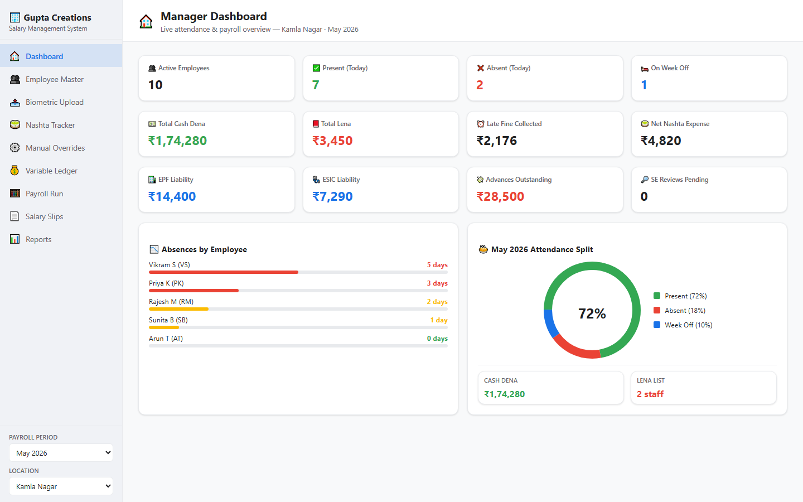
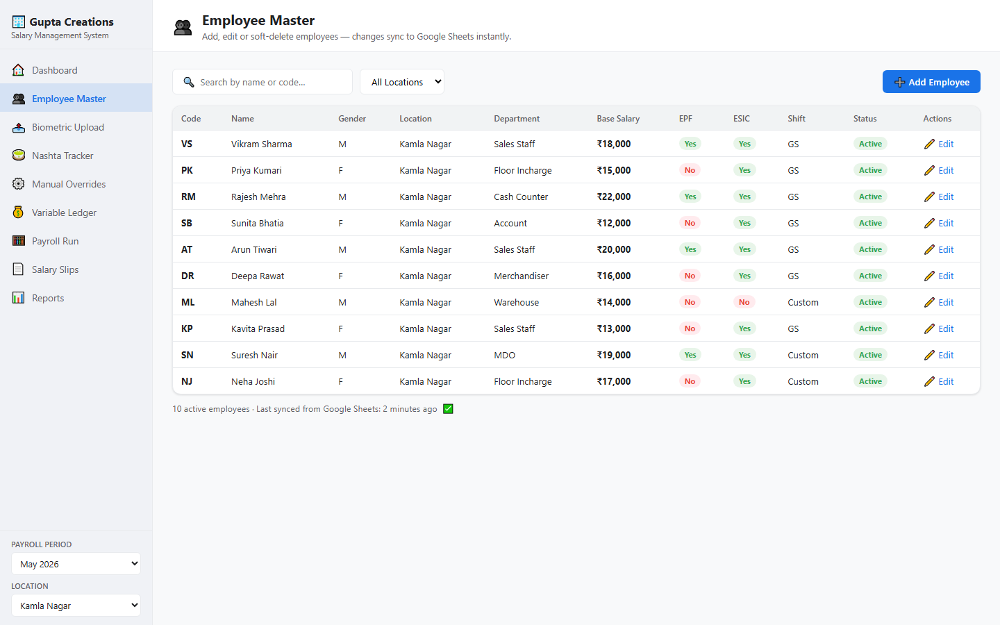
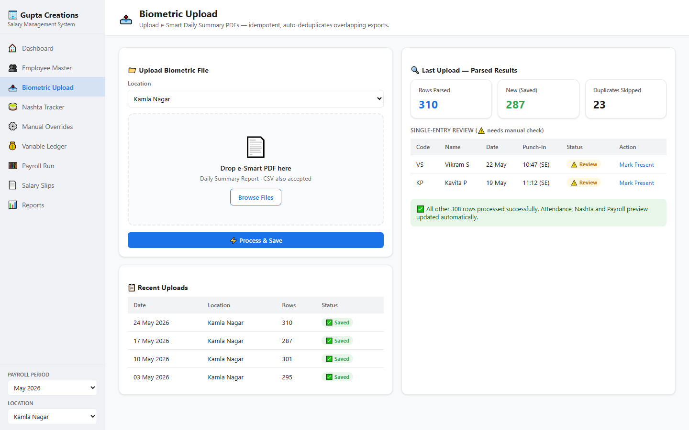
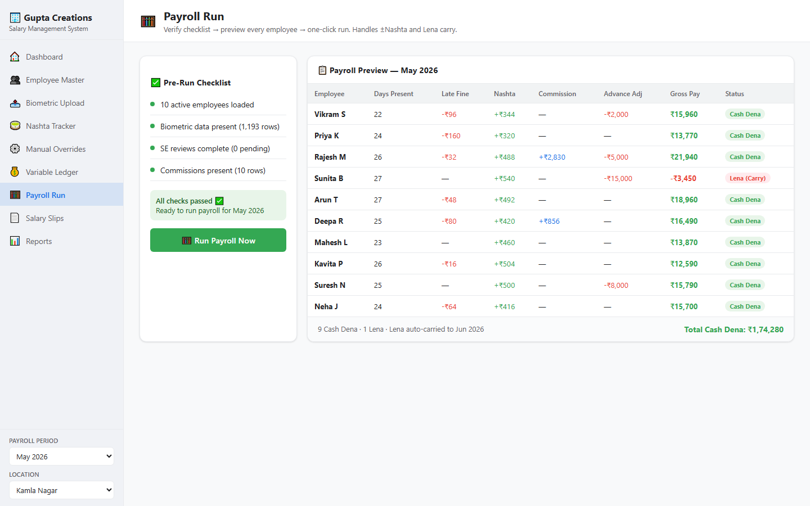
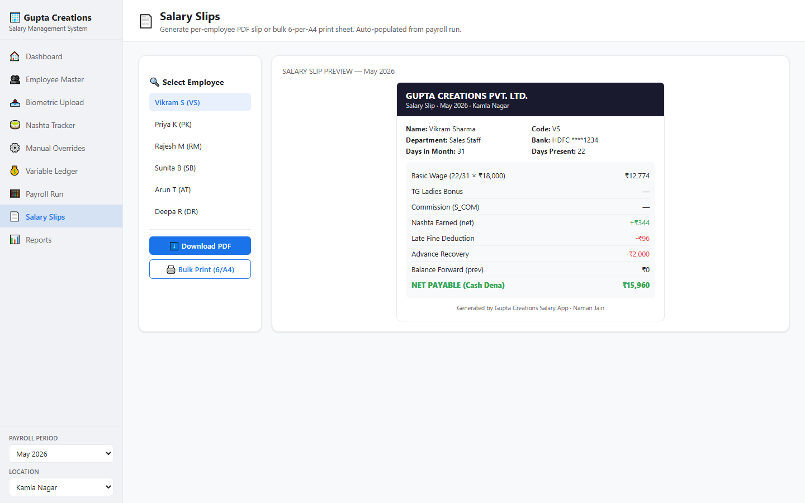
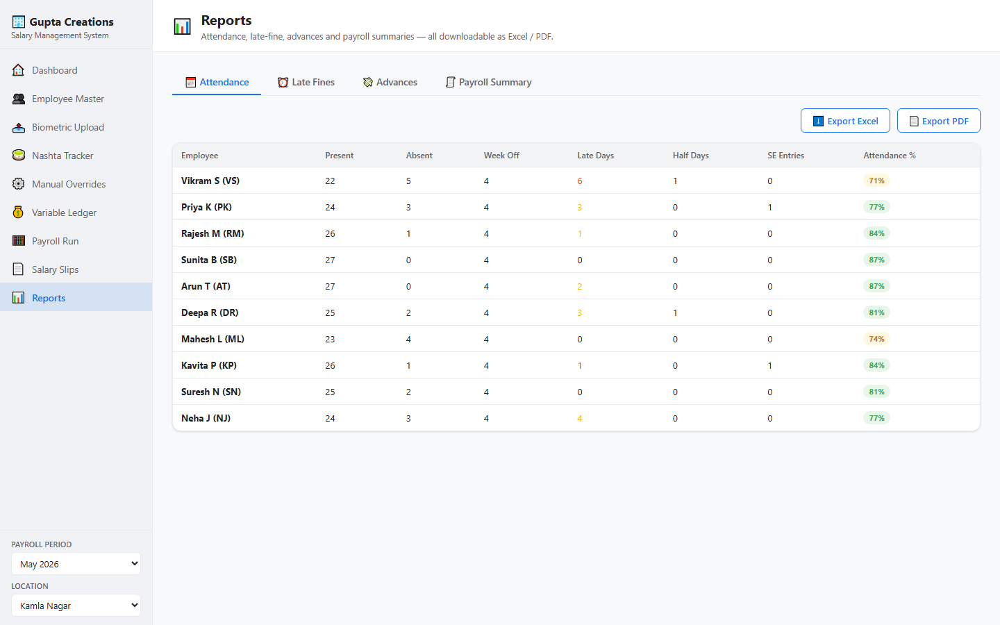
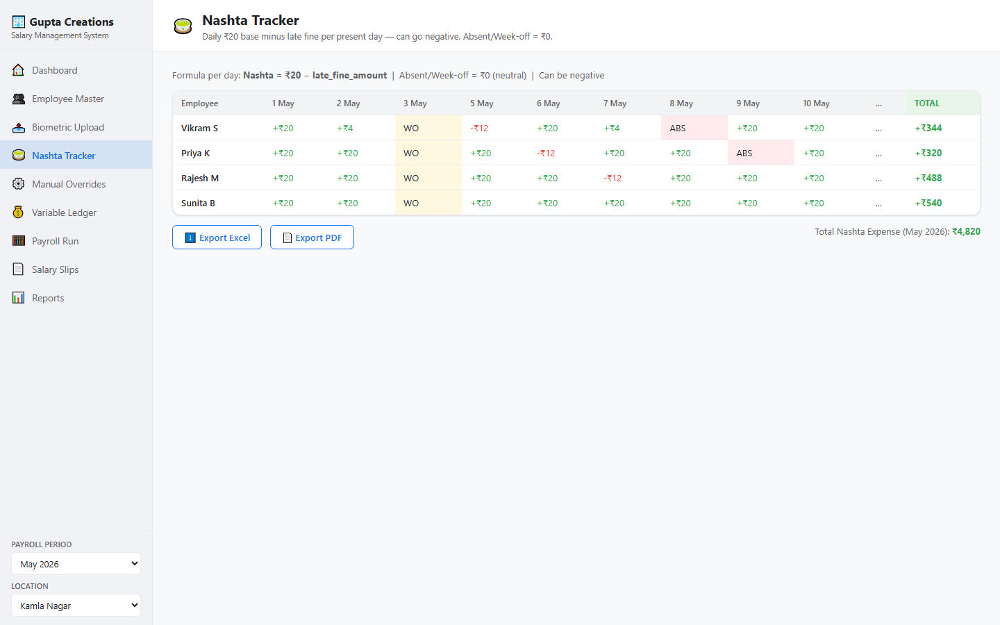
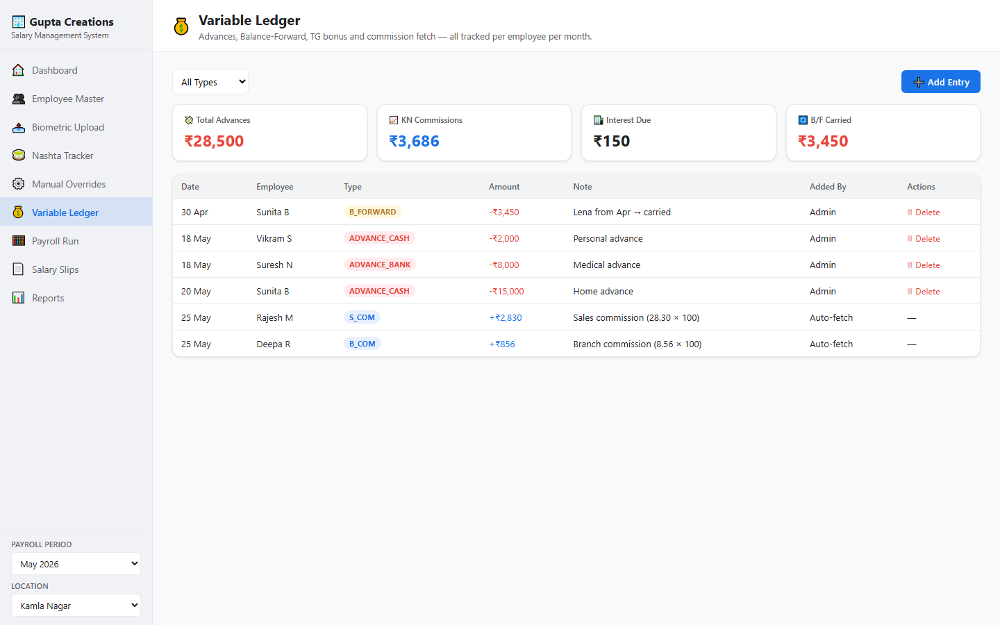

<div align="center">


<br/>

[](https://python.org)
[](https://streamlit.io)
[](https://sheets.google.com)
[](tests/)
[](LICENSE)

**Internal HR & payroll engine for 200+ retail staff across 5 locations.**
Built with zero vendor lock-in — runs fully offline, or syncs live to Google Sheets.

[📺 Watch Demo Video](#demo) · [🚀 Quick Start](#quick-start) · [📸 Screenshots](#screenshots) · [🧪 Tests](#tests)

</div>

---

## 📺 Demo

https://github.com/user-attachments/assets/demo_video.mp4

> 60-second walkthrough: Dashboard → Payroll Run → Salary Slips — all features live.

---

## 📸 Screenshots

<table>
<tr>
<td width="50%">

<p align="center"><b>🏠 Dashboard</b><br/><sub>Live payroll KPIs, attendance split chart, today's absences</sub></p>
</td>
<td width="50%">

<p align="center"><b>👥 Employee Master</b><br/><sub>Editable grid, EPF/ESIC flags, Google Sheets auto-sync</sub></p>
</td>
</tr>
<tr>
<td width="50%">

<p align="center"><b>📤 Biometric Upload</b><br/><sub>Drop e-Smart PDF, auto-parse, dedup, flag SE entries</sub></p>
</td>
<td width="50%">

<p align="center"><b>🧮 Payroll Run</b><br/><sub>Pre-flight checklist → per-employee preview → one-click run</sub></p>
</td>
</tr>
<tr>
<td width="50%">

<p align="center"><b>📄 Salary Slips</b><br/><sub>PDF per employee or bulk 6-per-A4 print sheet</sub></p>
</td>
<td width="50%">

<p align="center"><b>📊 Reports</b><br/><sub>Attendance, late-fines, payroll summaries — Excel & PDF export</sub></p>
</td>
</tr>
<tr>
<td width="50%">

<p align="center"><b>🍵 Nashta Tracker</b><br/><sub>Daily ₹20 − late-fine per employee, monthly totals</sub></p>
</td>
<td width="50%">

<p align="center"><b>💰 Variable Ledger</b><br/><sub>Advances, commissions, B/F, interest — all audited</sub></p>
</td>
</tr>
</table>

---

## ✨ Feature Overview

### 9 Pages — Everything HR Needs

| Page | What it handles |
|------|----------------|
| 🏠 **Dashboard** | Live KPIs: Cash Dena, Lena, late fines, nashta, EPF/ESIC, advances outstanding. Attendance donut + absences-by-employee bar chart. |
| 👥 **Employee Master** | Add / edit / soft-delete employees. Stores salary, EPF, ESIC, shift type, bank details. Editable grid with inline save. |
| 📤 **Biometric Upload** | Upload e-Smart "Daily Summary Report" PDFs. Idempotent — overlapping exports are de-duplicated automatically. Flags single-entry (SE) rows for manager review. |
| 🍵 **Nashta Tracker** | Day-by-day grid: ₹20 base minus that day's late fine. Can go negative. Absent / week-off = ₹0 (neutral). Exportable as Excel or PDF. |
| ⚙️ **Manual Overrides** | Week-off day change, single/double absent, long leave — all stamped with admin name for audit trail. |
| 💰 **Variable Ledger** | Cash advances, bank advances, balance-forward from last month, interest (1% if advance > ₹10k), TG bonus, and auto-fetched KN commissions. |
| 🧮 **Payroll Run** | Pre-flight checklist (biometric loaded? SE reviewed? commissions present?) → per-employee preview table → one-click run. Auto-carries Lena to next month. |
| 📄 **Salary Slips** | Generates ReportLab PDF per employee. Bulk print mode fits 6 slips on one A4 sheet for cost-efficient printing. |
| 📊 **Reports** | Attendance breakdown, late-fine analysis, advance ledger, payroll summary — all downloadable as Excel or PDF. |

---

## 🔄 Portable — Runs Anywhere, No Server Required

This is the core design philosophy: **the app works identically with or without internet or Google credentials.**

```
┌──────────────────────────────────────────────────────┐
│                sheets_sync.py                        │
│                                                      │
│  credentials present?                                │
│    YES ──▶ GSpreadBackend (live Google Sheets)       │
│    NO  ──▶ LocalBackend   (CSV files in local_db/)  │
└──────────────────────────────────────────────────────┘
```

| Scenario | Works? | Notes |
|----------|--------|-------|
| **No internet, no credentials** | ✅ | Reads/writes `local_db/*.csv` |
| **Google Sheets connected** | ✅ | Auto-syncs every read/write |
| **Laptop → different laptop** | ✅ | Copy the folder, run `pip install -r requirements.txt`, done |
| **Streamlit Cloud deploy** | ✅ | Add secrets → Google Sheets mode auto-activates |
| **Offline demo / training** | ✅ | `seed_data/` provides 10 employees + full May-2026 biometric |

**Zero code changes needed to switch modes.** The same `app.py` runs in all environments.

---

## 💡 Business Logic (Verified Against Paper Chits)

All rules live in `modules/salary_engine.py` — pure Python, fully unit-tested.

### Salary Calculation

```
Daily Wage = Base Salary ÷ Calendar Days in Month

Earned Salary = Daily Wage × Days Present
              + Extra Present Pay (if applicable)
              + Commissions (S_COM, B_COM, L_COM × 100 scale)
              + TG Ladies Bonus
              + Net Nashta (can add or subtract)

Total Deductions = EPF + ESIC + Late Fines + Advance Recovery + Interest

Net Payable = Earned Salary − Total Deductions + Balance Forward

  Net > 0  →  Cash Dena  (manager pays employee)
  Net < 0  →  Lena       (auto-carried as B/F to next month)
```

### Late Fine Slabs (minutes late vs shift start)

| Late (minutes) | Fine |
|----------------|------|
| 0 | ₹0 |
| 1–14 | ₹16 |
| 15–29 | ₹32 |
| 30–59 | ₹48 |
| 60–89 | ₹64 |
| 90–119 | ₹80 |
| 120+ | Salary cut (treated as half-day or absent) |

### Shift Timings (auto-selected per employee)

| Group | Weekday Start | Monday Start | Exception |
|-------|--------------|--------------|-----------|
| General Staff (GS) Female | 10:00 | 11:00 | — |
| General Staff (GS) Male | 10:00 | 11:00 | — |
| Warehouse | 09:00 | 09:00 | Custom |
| MDO | 10:30 | 10:30 | Custom |

### Nashta Formula

```
Per present day:  Nashta = ₹20 − late_fine_for_that_day
Absent / WO:      Nashta = ₹0  (neutral, not a deduction)
Monthly total:    Sum of all daily nashta values (can be negative)
```

### Commission Scale

KN branch commissions are stored in `SALE_REPORT_KN` as a 2-decimal scaled value
(`28.30` = ₹2,830). The app multiplies by 100 via `commission_to_rupees()` in
`sheets_sync.py` — handled exactly once so payroll and slips always show whole rupees.

---

## 🚀 Quick Start

**Runs in 30 seconds — no Google account, no internet needed.**

```bash
# 1. Clone / download the folder
cd gupta_creations_salary_app

# 2. Create virtual environment
python -m venv .venv

# Windows
.venv\Scripts\activate
# macOS / Linux
source .venv/bin/activate

# 3. Install dependencies
pip install -r requirements.txt

# 4. Launch
streamlit run app.py
```

Opens at **http://localhost:8501** in Local mode. All 9 pages show live data
immediately from the seed dataset — no setup required.

### Switching to Google Sheets (optional)

```bash
# Copy the example config
cp secrets/service_account.example.json secrets/service_account.json
# Fill in your service account credentials (see DEPLOY.md)

# That's it — app auto-detects and switches to Sheets on next launch
streamlit run app.py
```

See [DEPLOY.md](DEPLOY.md) for the full Google Sheets setup guide including the
Apps Script that creates all 11 tabs with correct headers.

---

## 🧪 Tests

```bash
# Unit tests — salary engine, utils, parser
pytest -q                          # must show 31 passed

# End-to-end smoke test
python tools/smoke_payroll.py      # seeds 10 employees, runs full payroll

# Boot verification (all 9 pages)
python tools/verify_app.py
```

All 31 tests were verified against handwritten paper payroll chits for May 2026.

---

## 🗂️ Project Structure

```
gupta_creations_salary_app/
│
├── app.py                      ← entry point (navigation + sidebar + theme)
├── requirements.txt
│
├── modules/
│   ├── constants.py            ← tab schemas, enums, THEME colors (single truth)
│   ├── salary_engine.py        ★ ALL payroll rules (pure Python, unit-tested)
│   ├── processing.py           ← biometric + overrides + holidays → attendance
│   ├── sheets_sync.py          ← dual-backend: Google Sheets OR local CSV
│   ├── biometric_parser.py     ← e-Smart PDF/CSV parsing, dedup, SE flagging
│   ├── pdf_generator.py        ← salary slips + reports via ReportLab
│   ├── reporting.py            ← page-level aggregation helpers
│   ├── utils.py                ← dates, Indian ₹ formatting, validators
│   └── ui.py                   ← shared Streamlit helpers + CSS injection
│
├── pages/                      ← one file per nav page (9 total)
│   ├── dashboard.py
│   ├── employees.py
│   ├── biometric.py
│   ├── nashta.py
│   ├── overrides.py
│   ├── ledger.py
│   ├── payroll.py
│   ├── slips.py
│   └── reports.py
│
├── seed_data/                  ← demo data (anonymised for public repo)
│   ├── employee_seed.csv
│   ├── biometric_may2026.csv
│   └── commissions_may2026.csv
│
├── google_apps_script/
│   └── setup_sheets.gs         ← creates all 11 Google Sheet tabs + headers
│
├── secrets/
│   └── service_account.example.json   ← template (real file gitignored)
│
├── tools/
│   ├── smoke_payroll.py
│   ├── verify_app.py
│   └── build_employee_master.py
│
├── tests/                      ← 31 pytest tests
│
└── assets/
    ├── screenshots/            ← 9 page screenshots
    └── demo_video.mp4          ← 60-second narrated walkthrough
```

---

## ⚙️ Tech Stack

| Layer | Tech | Why |
|-------|------|-----|
| UI | Streamlit 1.35+ | Rapid multi-page app, native data_editor, no JS |
| Data backend | Google Sheets via gspread 6 + fallback local CSV | Portable — zero DB setup |
| PDF generation | ReportLab 4.2 | Precise A4 slip layout, 6-per-page print |
| Spreadsheet export | openpyxl + pandas | Excel reports with formatting |
| Charts | Plotly 5.20 | Interactive attendance and payroll charts |
| Auth | Streamlit session state | Simple login gate, manager-only access |
| Tests | pytest | 31 unit + integration tests |

---

## 🔒 Security Notes

- `secrets/service_account.json` is **gitignored** — never committed
- `local_db/*.csv` with real employee data are **gitignored**
- Login is manager/admin only — no employee-facing portal
- All payroll overrides are stamped with admin username + timestamp

---

## 👤 Built By

**Naman Jain** — [PixlForge Studio](https://pixlforgestudio.in)

AI automation tools and custom business software for Indian SMBs.

---

<div align="center">
<sub>Status: Pilot build — Kamla Nagar branch, 10 employees, May 2026. Engine verified 31/31 tests.</sub>
</div>
